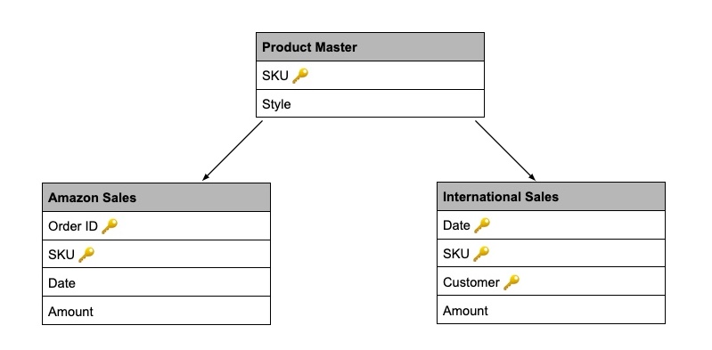
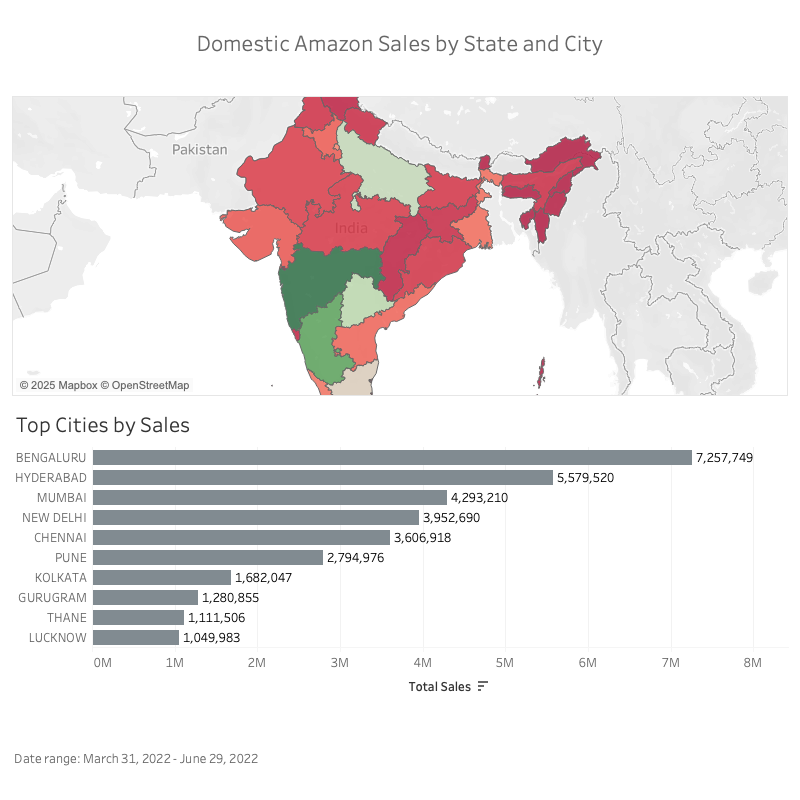

# E-Commerce Sales Analysis: Geographic Insights for Strategic Growth

## Executive Summary

This project analyzes e-commerce sales data from an Indian online fashion retailer, focusing on geographic distribution and regional performance patterns. When initial time-series forecasting proved inappropriate due to data quality constraints, I pivoted to geographic analysis, uncovering actionable insights about regional sales patterns across 129,000+ Amazon transactions.

### Key Findings:

- **Four states drive 60%+ of revenue**: Maharashtra, Karnataka, Telangana, and Uttar Pradesh represent the company's geographic strongholds.
- **Urban concentration**: Top 5 cities (Bengaluru, Hyderabad, Mumbai, New Delhi, Chennai) account for disproportionate sales volume while maintaining consistent average order values. 
- **Growth opportunities identified**: High-performing cities in lower-performing states (New Delhi, Kolkata, Gurugram) present expansion opportunities. 
- **Product uniformity**: Kurta and kurta sets dominate across all regions, suggesting consistent brand positioning nationwide.

**Business Impact**: These insights enable targeted marketing investments, optimized inventory distribution, and strategic expansion into high-potential markets.

---

## Background and Overview

This project analyzes e-commerce sales data from an Indian online fashion retailer to understand geographic sales patterns and identify strategic growth opportunities.

### Business Problem 
The company initially sought to understand historical sales patterns to identify trends and create forecasts. However, during data exploration and cleaning, significant data quality issues emerged that required a strategic pivot in the analysis approach.

### The Pivot: From Time-Series to Geographic Analysis
**Original Goal:** Analyze 163,000+ transactions to identify sales trends, seasonal patterns, and create a 6-month sales forecast.

**What Changed:** After extensive data cleaning, it became clear that the two sales channels had minimal temporal overlap (1 day), making traditional time-series forecasting inappropriate. Rather than force an analysis that wouldn't yield valid insights, I pivoted to extract meaningful value from what the data *could* reliably tell us.

**Revised Goal**: Conduct geographic analysis of Amazon sales channel to understand:

1. Where customers are located and regional sales distribution
2. Top-performing cities and states by sales volume
3. Whether geographic regions show preferences for specific product categories

### Tools Used 
- **Excel**: Initial data exploration and quality assessment
- **SQL**: Data cleaning, transformation and analysis queries
- **Tableau**: Interactive dashboard creation and geographic visualization

---

## Data Structure Overview

The analysis focuses on Amazon sales data integrated with product catalog information:

- **Amazon Sales** (`amazonSales`): ~129K transactions from Amazon marketplace (March 2022 - June 2022)
- **Product Master** (`productMaster`): Product catalog including SKU, category, size, color, and stock levels

*Note: Original dataset included multiple sales channels. After data quality assessment, analysis focuses on Amazon sales data which provided complete geographic information necessary for regional analysis. International sales channel lacked location data and was excluded from this geographic study.
For detailed SQL queries and data transformation steps, see the Technical Documentation.*

---

## Geographic Analysis Dashboard

The interactive dashboard visualizes sales distribution across India, highlighting:

**State-level performance** with heat map visualization

**Top 10 cities** by total sales volume

**Key Visual Insights:**

- Strong concentration in southern and western India (Karnataka, Maharashtra, Telangana)
- Urban metros dominate sales volume despite similar order values

---
## Geographic Insights

### Business Question 1: Where are our Amazon customers located?

**State-Level Performance:** The highest total sales concentrate in four states: **Maharashtra, Karnataka, Telangana, and Uttar Pradesh**. These states represent the company's geographic strongholds and account for the majority of Amazon channel revenue.

**Uttar Pradesh Pattern:** While Uttar Pradesh ranks as the fourth highest-performing state, its sales pattern differs from the top three. The top three states each have one dominant city driving sales, but Uttar Pradesh's performance is distributed across three cities (ranked 10th, 11th, and 12th nationally). This suggests a more geographically distributed customer base within the state.

### Business Question 2: What are our top-performing cities and states by sales volume?

**Top 5 Cities:**

1. Bengaluru (Karnataka)
2. Hyderabad (Telangana)
3. Mumbai (Maharashtra)
4. New Delhi (Delhi)
5. Chennai (Tamil Nadu)

**Average Order Value Analysis:**

Average order value remains remarkably consistent across cities, despite dramatic differences in total sales volume. This indicates that customers in different cities spend similar amounts per order. The top-performing cities' revenue advantage comes from order frequency and customer volume, not higher spending per transaction.

**Strategic Implication**: Marketing efforts should focus on customer acquisition and retention in high-potential markets rather than increasing order values, which appear stable across geographies.

### Business Question 3: Do different regions show product category preferences?

**Category Performance:** Kurta and kurta sets are the top sellers across all top cities and top states. Category preferences show minimal geographic variation, with trending categories remaining consistent regardless of location.

**Strategic Implication:** The company has achieved strong, consistent brand positioning. Product mix and inventory can be standardized across regions without significant customization, simplifying operations and inventory management.

---

## Recommendations

### 1. Strengthen geographic strongholds

**Target markets:** Bengaluru, Hyderabad, Mumbai, Chennai

**Actions:**
- Increase marketing spend in these high-performing cities within high-performing states.
- Test premium product lines and new categories in these established markets.

**Expected Impact:** Maximize revenue from markets with proven demand and established customer base.

### 2. Pursue growth opportunities in high-potential cities

**Target Markets:** New Delhi, Kolkata, Gurugram

**Strategic Rationale:** These cities demonstrate strong individual performance but are located in states with otherwise lower overall performance. This represents an opportunity to replicate successful city-level strategies across the broader state.

**Actions:**
- Analyze what drives success in these cities (marketing channels, product mix, delivery experience).
- Expand successful tactics to other cities within the same state.
- Partner with local influencers or marketplaces in neighboring cities.

**Expected Impact:** Unlock state-level growth by replicating proven urban success to surrounding markets.

### 3. Investigate Uttar Pradesh's Distribution Pattern

**Strategic Rationale:** UP ranks 4th in state performance but has sales distributed across three mid-tier cities rather than one dominant metro.

**Actions:**
- Research whether this reflects population distribution or market penetration gaps.
- Test targeted campaigns in UP's tier-2 cities to determine growth ceiling.
- Evaluate whether success in distributed markets could inform strategy in other states.

**Expected Impact:** Develop playbook for success in distributed markets beyond major metros.

---

## Caveats and Assumptions

### Data Source & Scope
- Public Kaggle dataset; company name anonymized.
- Analysis period: March 2022 - June 2022 (4 months of Amazon sales data).
- 129,000+ transactions from Amazon sales channel.

### Geographic Scope
- Analysis limited to Amazon India sales data.
- International sales channel excluded due to lack of geographic data.
- Focus on state and city-level patterns within India.

### Data Completeness
- **Category Analysis:** ~5% of sales lack matching SKU in Product Master 
  (likely new products added after catalog snapshot); excluded from category 
  analysis.
- All geographic fields complete; no missing state/city data.

### Currency
All values in INR (Indian Rupees)

*For detailed data quality assessment, see [Data Quality Notes](documentation/dataQualityNotes.md).
For detailed cleaning decisions, see 
[Issue Log](documentation/eCommerceSalesIssueLog.csv)*

---

## Technical Documentation

For detailed technical implementation:
- **SQL Scripts:** See [sql/](sql/) folder for data cleaning and transformation queries
- **Data Dictionary:** See [documentation/data_dictionary.md](documentation/data_dictionary.md)  
- **ERD:** See [documentation/ERD.jpg](documentation/ERD01.jpg)

---

**Connect with me:** [LinkedIn](linkedin.com/in/kylimcqueen) | [kylimcqueen@gmail.com](mailto:kylimcqueen@gmail.com)

